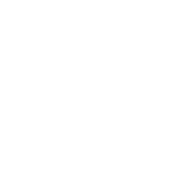

# 
 

#
 # My Documents [View An Example](https://raw.githubusercontent.com/Lucas5N/Got-it/main/productpageExample.pdf)

An E-commerce project developed as part of the Web Development course (TSW) at Unisa.

With Got-it the goal was to make a website that resembled functionalitywise other famous platforms, such as Vinted, Wallapop and so on, which enable users to buy and sell products.
